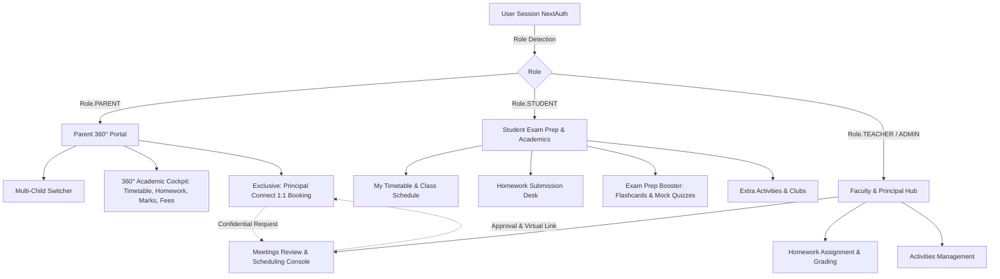

# Business Requirements Document (BRD)
## Next-Gen Parent 360° Portal, Student Exam Prep Booster & Confidential Principal Connect

---

| **Document Version** | 1.0.0 |
| **Status** | Approved for Implementation |
| **Target Platform** | Vidyalaya School Management System (SMS / SIS) |
| **Author** | Antigravity AI & Education Systems Engineering |
| **Date** | September 2026 |

---

## 1. Executive Summary & Vision

Modern K-12 education worldwide requires deep partnership between the school, parents, and students. Current legacy school ERPs treat parents merely as fee-paying spectators and students as passive consumers of marks. 

This document defines the requirements to transform Vidyalaya into a **World-Class School Experience Platform** benchmarked against leading global systems (**PowerSchool**, **Toddle**, **ManageBac**, and **Lead School**). 

### Key Pillars:
1. **360° Parent Access**: Parents gain real-time, transparent access to their child's academic lifecycle (attendance, timetable, daily homework, exam report cards, fee ledger, study materials, and school circulars).
2. **Confidential Leadership Connect (USP)**: An exclusive parent-to-principal/teacher 1-to-1 meeting booking system with agenda management, mode selection (in-person vs virtual video), and meeting minutes. **Strictly restricted from student access.**
3. **Student Exam Prep & Knowledge Booster (USP)**: An exam acceleration suite featuring interactive concept flashcards, self-assessment mock tests with instant auto-grading and knowledge-gap tips, syllabus progress tracking, and exam countdowns.
4. **Co-Curricular & Extra-Curricular Hub (USP)**: A shared ecosystem for school clubs, inter-house competitions, participation credits, and digital achievement badges across students, parents, and teachers.
5. **Universal Teacher & Administrative Governance**: Teachers and school leaders retain full visibility and oversight to manage appointments, evaluate student progress, and publish activities.

---

## 2. Global Benchmarking & Competitive Analysis

| Feature Dimension | Legacy ERP (e.g. Fedena/Vidyalaya Old) | Global Benchmark (PowerSchool / Toddle / ManageBac) | Vidyalaya NexGen (Our USP Implementation) |
| :--- | :--- | :--- | :--- |
| **Parent Academic Visibility** | Read-only PDF marks cards, delayed SMS | Real-time gradebook, live homework progress, digital attendance | **360° Real-time Cockpit**: Multi-child switcher, live timetable, homework status & feedback, radar mastery chart, fee receipts |
| **Parent-Leadership Communication** | Unscheduled physical visits or chaotic WhatsApp | In-app parent messaging, calendar appointments | **Principal Connect (1:1 Meeting)**: Confidential appointment portal with agenda triage, in-person / Zoom integration, status tracking |
| **Student Exam Readiness** | Static syllabus PDF | LMS assignment repository | **Exam Prep Accelerator**: Interactive 3D concept flashcards, timed mock quizzes with instant explanations, board exam countdown |
| **Extracurricular Activities** | Offline noticeboard lists | Portfolio tagging (Toddle CAS / IB) | **Co-Curricular Hub**: Club enrollments, competition schedules, digital achievement badges visible to parents and teachers |
| **Access Control (RBAC)** | Binary role tags | Fine-grained FERPA-compliant privacy | **Strict Isolation**: Confidential leadership meetings are strictly hidden from students; role-specific navigation |

---

## 3. Stakeholder Personas & Roles (RACI Matrix)

| Feature / Capability | Student | Parent | Teacher | Principal / Admin |
| :--- | :---: | :---: | :---: | :---: |
| **View Student Profile & Timetable** | **A** (Own) | **I** (Child) | **I** (Class) | **I** (All) |
| **Track & Submit Daily Homework** | **R / A** | **I** | **R** (Assign/Grade) | **I** |
| **View Exam Schedules & Report Cards** | **A** | **A** | **R** (Input Marks) | **I** |
| **Exam Prep Booster (Flashcards & Quizzes)** | **R / A** | **I** | **R** (Curate) | **I** |
| **Co-Curricular & Club Activities** | **R** (Join) | **I** | **R** (Mentor) | **A** |
| **Book 1-to-1 Meeting with Principal** | 🚫 **NO ACCESS** | **R** (Request) | **C / R** (Attend) | **A** (Approve/Host) |
| **Fee Ledger & Online Payment Receipts** | 🚫 **Hidden** | **R / A** | 🚫 **Hidden** | **A** (Accounts) |
| **Noticeboard & Push Notifications** | **I** (Relevant) | **I** (Relevant) | **R** (Publish) | **A** (Broadcast) |

*Legend: R = Responsible, A = Accountable, C = Consulted, I = Informed, 🚫 = Strictly Restricted*

---

## 4. Detailed Functional Specifications & USPs

### 4.1 USP 1: Parent 360° Academic & Pastoral Portal
* **Target Users**: Parents and Legal Guardians.
* **Child Selector**: For parents with multiple wards enrolled, provide a persistent child-switching selector that updates all views dynamically.
* **Core Views**:
  1. **Academic Schedule**: Daily schedule, periods, subjects, assigned faculty, and classroom/lab location.
  2. **Attendance Tracker**: Present %, absent days, late marks, and monthly calendar heatmap.
  3. **Homework Monitoring**: Real-time list of assigned tasks, submission status (`Submitted`, `Pending`, `Checked`), attached worksheets, and teacher evaluation comments.
  4. **Exams & Comprehensive Report Card**: Term examination schedules, subject-wise marks breakdown (theory + practical), percentage, grade, rank, and subject strengths/weaknesses radar.
  5. **Fee Ledger & Payments**: Total fee liability, paid amount, pending dues, downloadable invoice receipts, and instant simulated checkout.
  6. **Digital Learning Repository (LMS)**: Reference notes, syllabus summaries, and faculty video lectures.
  7. **Extracurricular Showcase**: Active clubs, competitions won, and merit badges awarded to the child.

### 4.2 USP 2: "Principal & Leadership Connect" (Confidential 1-to-1 Meeting System)
* **Access Control**: **STRICTLY EXCLUSIVE TO PARENTS, TEACHERS, AND PRINCIPALS / ADMINS.** Students are prohibited from viewing or booking meetings.
* **Booking Flow**:
  1. Parent selects student ward.
  2. Selects meeting recipient: **School Principal**, **Vice Principal**, or **Class Teacher**.
  3. Selects agenda category:
     - `ACADEMIC_PROGRESS` (Struggling in subjects, exam prep concerns)
     - `BEHAVIORAL_WELLBEING` (Social adjustment, anxiety, bullying concerns)
     - `SPECIAL_EDUCATIONAL_NEEDS` (Learning support, physical accommodations)
     - `ADMIN_FEES` (Fee concessions, scholarship requests, transfer documentation)
     - `CAREER_GUIDANCE` (Stream selection, competitive exam counseling)
  4. Selects format: **In-Person** (Principal's Executive Suite) or **Virtual** (Integrated Google Meet / Zoom link).
  5. Selects preferred date and standard time slot (e.g., 09:30 AM, 11:30 AM, 03:00 PM).
  6. Inputs detailed background notes and discussion agenda.
* **Administrative & Faculty Governance**:
  - Principal / Teachers receive instant notification and view incoming requests in `/meetings`.
  - Actions: `Confirm`, `Reschedule` (with alternate slot proposal), `Decline` (with explanatory remarks), or `Mark Completed`.
  - After the meeting, staff logs **Confidential Meeting Minutes & Action Items** stored securely in the student's pastoral record.

### 4.3 USP 3: "Exam Prep & Knowledge Booster Suite"
* **Target Users**: Students (with view-only progress visibility for Parents and Teachers).
* **Components**:
  1. **Interactive Concept Flashcards**:
     - Categorized by subject (Mathematics, Science, Social Science, English, Computer Science).
     - Front: Formula / Definition / Challenge question.
     - Back: Detailed step-by-step derivation, memory mnemonic, or solution.
     - Interactive controls: "Mastered" vs "Needs Practice", calculating mastery index.
  2. **Self-Assessment Timed Mock Quizzes**:
     - 5-to-10 question bite-sized practice tests aligned with CBSE/State syllabus.
     - Immediate scoring, time tracking, question-by-question explanations, and customized AI Study Tips based on weak performance areas.
  3. **Exam Countdown & Smart Revision Planner**:
     - Visual countdown timers for upcoming board/term examinations.
     - Syllabus completion progress bar per subject.
  4. **PYQ (Previous Year Questions) & Model Papers**:
     - One-click viewing and download of previous years' board papers and official marking schemes.

### 4.4 USP 4: Co-Curricular & Extra-Curricular Activities Hub
* **Target Users**: Students, Parents, and Teachers.
* **Capabilities**:
  - School club directory: Robotics & AI, Model UN / Debate Society, Eco Green Club, Sports League, Arts & Culture.
  - Event calendar: Upcoming inter-house sports meets, science exhibitions, cultural fests.
  - Student Registration: One-click club membership enrollment.
  - Digital Badges & Merit Wall: Recognition badges (e.g. "Science Olympiad Winner", "Debate Finalist", "100% Attendance Star") displayed on student and parent dashboards.

### 4.5 USP 5: Universal Notification & Circulars Center
* Audience segmentation: Ensure notices can target `STUDENTS`, `PARENTS`, `TEACHERS`, or `ALL`.
* Category tags: `ACADEMIC`, `EXAM`, `HOLIDAY`, `FEE`, `EVENT`, `URGENT`.
* Unread counter badge and instant dismissal/mark-as-read.

---

## 5. Security, Privacy & Role-Based Access Control (RBAC)

1. **Confidentiality of Leadership Communications**:
   - Meeting requests between parents and the principal contain sensitive family, psychological, or financial information. 
   - Under no circumstances should these records or endpoints be readable by student accounts.
2. **Student Identity Isolation**:
   - A parent can strictly query data belonging to their verified children (`parentId == session.user.parent.id`).
   - A student can strictly query data belonging to their own record (`studentId == session.user.student.id`).
3. **Data Integrity**:
   - Only authorized academic staff and administrators can post marks, assign homework, or publish notices.

---

## 6. Implementation Architecture

---

## 7. Verification & Acceptance Criteria
1. **Parent Navigation & Dashboard**:
   - Parent can log in with `parent@school.com` and immediately inspect child Aarav Sharma's attendance, timetable, homework, exam marks, and fees.
   - Parent has access to the "Principal Connect" 1:1 meeting booking system.
2. **Student Isolation**:
   - Student logging in with `student@school.com` sees their timetable, homework submissions, exam report cards, Exam Prep Booster, and Activities.
   - Student cannot access `/meetings` or book meetings with the principal.
3. **Teacher / Principal Governance**:
   - Teacher/Principal can log in, access `/meetings`, view parent requests, approve them with meet links or rooms, and add meeting notes.
4. **Interactive Polish**:
   - Flashcards flip smoothly in 3D.
   - Mock quizzes compute real-time scores with explanations.
   - Booking a meeting adds it to the live state and updates status.
